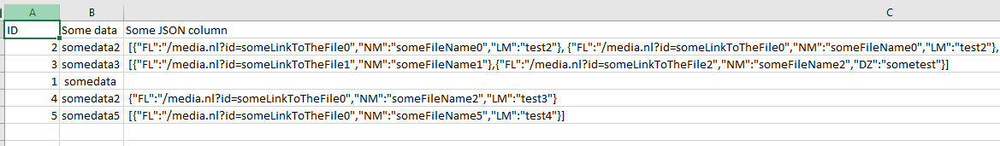
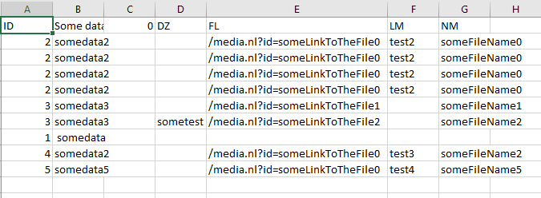

# JSON in a cell to new rows

## Table of Contents

-   [Description](#description)
-   [How to Deploy](#how-to-deploy)
-   [Purpose](#purpose)
-   [Usage](#usage)

## Description

This project contains a Python script that processes a JSON column in a CSV file and outputs the results to another CSV file. The script is designed to handle cases where a column in the CSV file contains JSON-encoded data, and it aims to extract the JSON objects into separate columns for further analysis.

## How to Deploy

To deploy this project **as standalone script**, follow the steps below:

1.  Clone the repository to your local machine or download the script directly.
    
2.  Ensure you have Python installed on your system (tested with Python 3.7.9).
    
3.  Install the required libraries by running the following command in your terminal or command prompt: 
  
    `pip install pandas` 
    
4.  Prepare your input data:
    
    -   Create a CSV file with the data you want to process. Ensure that the CSV file includes a column containing JSON-encoded data that you want to extract.
5.  Update the script:
    
    -   Replace `"example.csv"` in the `input_file` variable with the path to your CSV file.
    -   If your JSON column has a different name, change the value of the `json_column_name` variable to match the column name in your CSV file.
6.  Run the script:
    
    -   Open a terminal or command prompt and navigate to the directory where you saved the script.
        
    -   Execute the following command:
        
        `python script_name.py` 
        
        (Replace `script_name.py` with the actual name of the Python script file.)
        
7.  Once the script finishes processing, a new CSV file named `"output.csv"` will be created in the same directory. This file will contain the data with the JSON objects extracted into separate columns.

Or you can just import this as a function :)    

## Purpose

The purpose of this project is to facilitate the extraction of JSON data from a CSV file. It can be beneficial when dealing with datasets where information is stored in JSON format within a column. By processing this JSON column, the data becomes more structured and suitable for analysis, making it easier to gain insights and perform further data manipulations.
See example below.

Transforms to

## Usage

This project can be useful in various scenarios, including:

-   Data Preprocessing: Extracting JSON data from a CSV file before further analysis.
-   Data Exploration: Gaining insights from JSON-encoded data stored in a CSV column.
-   Data Transformation: Preparing data for machine learning models or other data processing tasks that require structured data.

Note: The script includes error handling to ensure that the program does not terminate abruptly if there are issues processing the JSON column. If an error occurs, a warning message will be displayed, and the original DataFrame will be returned without any modifications.
### Enjoy